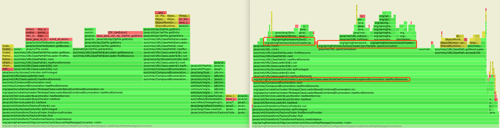
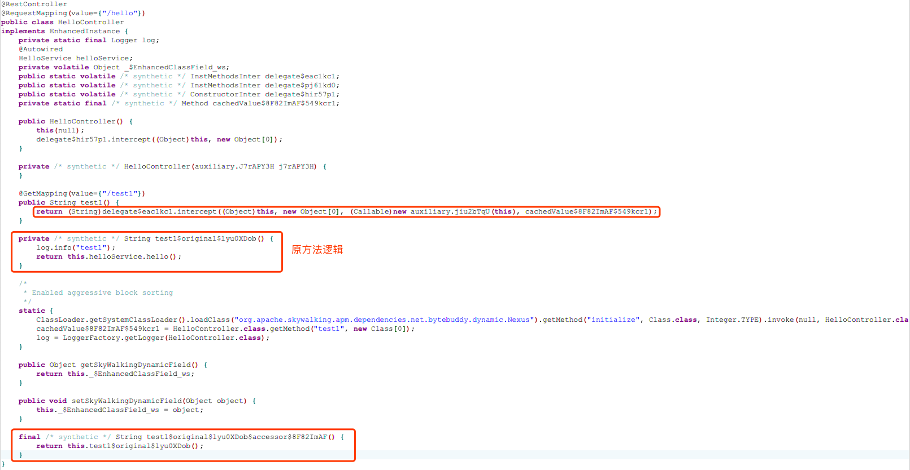

## 背景
接收到公司业务部门的开发反馈，应用在升级公司内部框架后，UAT（预生产）环境接口性能压测不达标。

升级前压测报告：


升级后压测报告：


在机器配置（1C4G）相同的情况下，吞吐量从原来的 53.9/s 下降到了 6.4/s，且 CPU 负载较高。

并且开发反馈从公司全链路监控系统 SkyWalking 中查询到的链路信息可以得知大部分请求 Feign 调用的耗时不太正常（390ms），而实际被调用的下游服务响应速度很快（3ms）。


## 定位问题
在接收到反馈以后，我立即申请了相应机器的权限，并往相应机器上传了 Arthas（version 3.4.3）。

让业务方保持压测，开始问题定位。

### 1.  执行 profiler 命令对 CPU 进行性能分析

```java
[arthas@17962]$ profiler start -d 30 -f /tmp/arthas/1.txt
```
等待 30s 后，打开 1.txt，查看 CPU 性能分析结果，开头部分示例如下：

```java
--- 1630160766 ns (4.24%), 141 samples
  ......
  [14] org.springframework.boot.loader.LaunchedURLClassLoader.definePackageIfNecessary
  [15] org.springframework.boot.loader.LaunchedURLClassLoader.loadClass
  [16] java.lang.ClassLoader.loadClass
  [17] java.lang.Class.forName0
  [18] java.lang.Class.forName
  [19] org.springframework.util.ClassUtils.forName
  [20] org.springframework.http.converter.json.Jackson2ObjectMapperBuilder.registerWellKnownModulesIfAvailable
  [21] org.springframework.http.converter.json.Jackson2ObjectMapperBuilder.configure
  [22] org.springframework.http.converter.json.Jackson2ObjectMapperBuilder.build
  [23] org.springframework.web.servlet.config.annotation.WebMvcConfigurationSupport.addDefaultHttpMessageConverters
  [24] org.springframework.web.servlet.config.annotation.WebMvcConfigurationSupport.getMessageConverters
  [25] org.springframework.boot.autoconfigure.http.HttpMessageConverters$1.defaultMessageConverters
  [26] org.springframework.boot.autoconfigure.http.HttpMessageConverters.getDefaultConverters
  [27] org.springframework.boot.autoconfigure.http.HttpMessageConverters.<init>
  [28] org.springframework.boot.autoconfigure.http.HttpMessageConverters.<init>
  [29] org.springframework.boot.autoconfigure.http.HttpMessageConverters.<init>
  [30] com.zhangmen.xxx.DefaultFeignConfig.lambda$feignDecoder$0
  [31] com.zhangmen.xxx.DefaultFeignConfig$$Lambda$704.256909008.getObject
  [32] org.springframework.cloud.openfeign.support.SpringDecoder.decode
  [33] org.springframework.cloud.openfeign.support.ResponseEntityDecoder.decode
	......
```

### 2.  对可疑的方法执行 trace 命令输出方法路径上每个节点的耗时

分析上一步得到的 CPU 性能分析结果，可以发现最占用 CPU 的栈中，确实有 Feign 相关的栈帧。

并且发现 Feign 相关的栈帧周围出现了 `com.zhangmen` 相关的栈帧，`com.zhangmen.xxx.DefaultFeignConfig$$Lambda$704.256909008.getObject` 和 `com.zhangmen.xxx.DefaultFeignConfig.lambda$feignDecoder$0`。

在 1.txt 中搜索 `com.zhangmen.xxx.DefaultFeignConfig`，发现有 340 次命中，因此认为这是一个非常可疑的方法。

执行 trace 命令输出该方法路径上每个节点的耗时：

```java
[arthas@17962]$ trace com.zhangmen.xxx.DefaultFeignConfig * '#cost>200' -n 3
`---[603.999323ms] com.zhangmen.xxx.DefaultFeignConfig:lambda$feignEncoder$1()
    `---[603.856565ms] org.springframework.boot.autoconfigure.http.HttpMessageConverters:<init>() #42
```

发现 `org.springframework.boot.autoconfigure.http.HttpMessageConverters:<init>()` 比较耗时，并继续一层层 trace 追踪下去：

```java
[arthas@17962]$ trace org.springframework.boot.autoconfigure.http.HttpMessageConverters <init> '#cost>200' -n 3
......
[arthas@17962]$ trace org.springframework.http.converter.json.Jackson2ObjectMapperBuilder registerWellKnownModulesIfAvailable '#cost>200' -n 3
```


最终发现 `org.springframework.util.ClassUtils:forName()` 比较耗时，并且抛出了异常。

使用 watch 命令查看具体的异常：

```java
[arthas@17962]$ watch org.springframework.util.ClassUtils forName -e "throwExp" -n 3
```


## 解决问题

将定位到的问题，反馈给相关业务开发，并建议引入 `jackson-datatype-joda` 依赖。

引入依赖后压测报告：


吞吐量从原来的 6.4/s 提升到了 69.3/s，比升级框架前的 53.9/s 还要高。

这时候相关业务开发反馈，这个问题是代码中自定义了 Feign 的编解码器（下图所示）导致的，并且这个编解码器在升级框架前也是一直存在的。


于是，对升级框架前的代码进行压测并在压测过程中使用 Arthas 执行以下命令：


发现同样有这个异常。引入 `jackson-datatype-joda`  依赖，再次进行压测，压测报告如下：


汇总前面的压测结果：


可以发现一个新的问题：为什么新旧版本同时不引入依赖，吞吐量相差近 8 倍，新旧版本同时引入依赖，吞吐量相差近 1 倍？

## 进一步定位问题
根据上一步中发现的新问题，接下来对 `未升级框架并引入依赖的版本` 和 `升级框架并引入依赖的版本` 分别进行压测，并在压测过程中使用 Arthas 的 profiler 命令采样 CPU 性能分析数据，得到样本 1 和样本 2 。并从样本 1 和样本 2 中找到相似栈进行对比：


通过对比可以发现，两个样本的相似栈的前 17 行有所不同。并对样本 2 中的可疑栈帧进行 trace 追踪：

```java
[arthas@10561]$ trace org.apache.catalina.loader.WebappClassLoaderBase$CombinedEnumeration * '#cost>100' -n 3
`---[171.744137ms] org.apache.catalina.loader.WebappClassLoaderBase$CombinedEnumeration:hasMoreElements()
    `---[171.736943ms] org.apache.catalina.loader.WebappClassLoaderBase$CombinedEnumeration:inc() #2685
        `---[171.724546ms] org.apache.catalina.loader.WebappClassLoaderBase$CombinedEnumeration:inc()
```

发现升级框架后，在类加载器这部分存在比较耗时的情况。

而对样本 1 中这部分进行 trace 追踪没有出现耗时大于 100ms 的情况。

又进一步使用 profiler 命令，分别生成两个版本在压测场景下的火焰图，并找到相似栈进行对比：

```java
[arthas@10561]$ profiler start -d 30 -f /tmp/arthas/1.svg
```



发现 `升级框架并引入依赖的版本` 还多出了一些 `org/springframework/boot/loader/` 相关的栈。

## 进一步解决问题

将新的发现反馈给相关业务开发。

他们反映此次除了框架升级外，还有 Spring Boot war to jar 部署的调整。从使用独立的 Tomcat war 部署，改造成用 Spring Boot 内嵌 Tomcat java -jar 部署。故怀疑两种部署方式在类加载器上存在性能差异。

相关业务开发在我上一步定位问题期间，根据我最初定位到的问题，在 Google 搜索 `feign com.fasterxml.jackson.datatype.joda.JodaModule`，找到了一篇相关的文章《loadClass 导致线上服务卡顿分析》(https://meantobe.github.io/2019/12/21/ClassLoader/)。

文章中的作者，遇到的问题与我们基本相似。

看了这篇文章后，我又 Debug 了部分源码，最后了解到问题产生的根本原因是： `SpringEncoder` / `SpringDecoder ` 在每次编码 / 解码时都会调用 `ObjectFactory<HttpMessageConverters>.getObject()).getConverters()` 获取 `HttpMessageConverters`。而我们自定义的 `DefaultFeignConfig` 中配置的这个 `ObjectFactory<HttpMessageConverters>` 的实现是每次都 new 一个新的 ` HttpMessageConverters` 对象。`HttpMessageConverters` 的构造方法又默认会执行 `getDefaultConverters` 方法获取默认的 `HttpMessageConverter` 集合，并初始化这些默认的 `HttpMessageConverter`。其中的 `MappingJackson2HttpMessageConverter`（有两个，见下图） 每次初始化时都会加载不在 `classpath` 中的 `com.fasterxml.jackson.datatype.joda.JodaModule` 和  `com.fasterxml.jackson.datatype.joda$JodaModule`（`org.springframework.util.ClassUtils` 加载不到类时，会尝试再加载一下内部类），并抛出 `ClassNotFoundException`，且该异常最后被生吞。而部分和 XML 相关的默认的 `HttpMessageConverter` ，`SourceHttpMessageConverter` 和 `Jaxb2RootElementHttpMessageConverter` （各有两个，见下图）每次初始化时，会执行 `TransformerFactory.newInstance()`，执行过程中会使用 SPI 扫描 `classpath` 下的 `META-INF / services` 目录获取具体的实现，并且每次扫描完也没有获取到具体的实现，最终使用默认指定的 `com.sun.org.apache.xalan.internal.xsltc.trax.TransformerFactoryImpl` 作为实现。最终导致每一次 Feign 调用（包含编码和解码），都会加载 4 次不在 `classpath` 中的 `com.fasterxml.jackson.datatype.joda.JodaModule` 和 `com.fasterxml.jackson.datatype.joda$JodaModule` （共8次），且 8 次使用 SPI 扫描 `classpath` 下的 `META-INF / services` 目录获取查找不到的实现，而 war to jar 后，类加载器在频繁查找和加载资源上的性能有所下降，最终导致严重影响接口性能。

默认的 `HttpMessageConverter` 集合：


部分关键代码如下：

`org/springframework/boot/autoconfigure/http/HttpMessageConverters.<init>`：


`org/springframework/http/converter/json/Jackson2ObjectMapperBuilder.registerWellKnownModulesIfAvailable`：


`org/springframework/util.ClassUtils.forName `：


`org/springframework/http/converter/xml/SourceHttpMessageConverter`：


`javax/xml/transform/FactoryFinder.find`：


文章中对于这个问题还提供了两种解决方法：

第一种方法，就是我最初建议的引入 `jackson-datatype-joda` 依赖，避免每次初始化默认的 `MappingJackson2HttpMessageConverter` 时 ClassLoader 反复加载不在 `classpath` 中的 `com.fasterxml.jackson.datatype.joda.JodaModule` 和 `com.fasterxml.jackson.datatype.joda$JodaModule`。

第二种方法，不初始化默认的 `HttpMessageConverter`。由于我们此处只需要使用自定义的 `FastJsonHttpMessageConverter` 来执行编解码，完全可以避免执行 `getDefaultConverters` 方法，重复初始化许多用不到的默认的 `HttpMessageConverter`。因此在 new  `HttpMessageConverters` 对象时 ，可以将 `addDefaultConverters` 参数设置为 false。

```java
ObjectFactory<HttpMessageConverters> objectFactory = () -> new HttpMessageConverters(false, new HttpMessageConverter[] { (HttpMessageConverter)fastJsonHttpMessageConverter });
```

实际上，我们还可以修改 `DefaultFeignConfig` 中 `ObjectFactory<HttpMessageConverters>` 的实现，避免每次都 new 一个新的 ` HttpMessageConverters` 对象（重复初始化 HttpMessageConverters），实现进一步优化。

故建议相关业务开发，将 `DefaultFeignConfig` 修改成如下代码：


在相关业务开发将新旧版本代码中的 `DefaultFeignConfig` 都进行改进并部署到 FAT（测试）环境以后，我在自己本机用 JMeter 对 FAT 环境进行了模拟压测。

旧版改进后压测结果：


新版改进后压测结果：


发现此时，两个版本的接口性能已经基本相同。

最终测试人员在 UAT 环境，对升级框架并改进 `DefaultFeignConfig` 后的代码再次进行压测，压测结果如下：


吞吐量从最初不达标的 6.4/s，提升到了160.4/s。

那为什么 war to jar 部署的调整，会导致类加载器在频繁查找和加载资源时性能有所下降呢？

在对 SpringBoot 可执行 jar 的原理做了一番了解以后。怀疑和 Spring Boot 为了做到能够以一个 fat jar 来启动，从而扩展了 JDK 的 JarFile URL 协议，并定制了自己的 ClassLoader 和  jar 文件协议的 Hander，实现了 jar in jar、jar in directory 的加载方式有关。

对  SpringBoot 可执行 jar 原理感兴趣的朋友可以参考：《可执行 jar 包》(https://blog.wangqi.love/articles/Java/%E5%8F%AF%E6%89%A7%E8%A1%8Cjar%E5%8C%85.html)。

## War2Jar 类加载器性能下降根因探究

为了验证自己的猜测，我在自己本机搭建了一个简单的 Demo。

Demo 中有两个服务，A 和 B。将 A 和 B 都注册到 Eureka 注册中心，并且 A 通过 Feign 调用 B。

接下来使用 Jmeter 在相同的配置下对各种场景进行压测，并在压测过程中使用 Arthas 的 profiler 命令生成各种场景下的火焰图。

压测结果如下（-Xms512m -Xmx512m）：


通过对比表格三和表格四可以得知，代码优化后，是否引入依赖，对吞吐量几乎没有影响。

通过表格三和表格四可以得知，代码优化后，在不会频繁查找和加载不存在的资源时，三种部署方式的吞吐量基本一致。

通过表格二可以得知，在频繁使用 SPI 获取 `classpath` 下查找不到的实现时，Tomcat war 部署性能更好。

通过表格一可以得知，在频繁加载不存在的类时，将 jar 包解压后通过 JarLauncher 启动性能更好。

对比表格一中 ③ 和 ② 相似栈的火焰图：


可以发现两者在 `org/springframework/boot/loader/LaunchedURLClassLoader.loadClass` 加载类时，存在差异。

② 不仅会执行 `java/lang/ClassLoader.loadClass`，还会执行 `org/springframework/boot/loader/LaunchedURLClassLoader.definePackageIfNecessary`。

查看 `org/springframework/boot/loader/LaunchedURLClassLoader.loadClass` 的源码：


发现存在一个条件分支。

查看 `org/springframework/boot/loader/Launcher.createArchive` 的源码：


发现这个条件的值与应用是 `可执行 jar 文件` 还是 `文件目录` 有关。

对 ② 再次进行压测，并 trace `org/springframework/boot/loader/LaunchedURLClassLoader.definePackageIfNecessary`：

```java
`---[165.770773ms] org.springframework.boot.loader.LaunchedURLClassLoader:definePackageIfNecessary()
    +---[0.00347ms] org.springframework.boot.loader.LaunchedURLClassLoader:getPackage() #197
    `---[165.761244ms] org.springframework.boot.loader.LaunchedURLClassLoader:definePackage() #199
```

发现这个地方确实存在比较耗时的情况。

阅读该部分源码，从注释中即可得知，`definePackageIfNecessary` 主要是为了在调用 `findClass` 之前尝试根据类名去定义类所在的 package，确保 jar 文件嵌套 jar 包里的 manifest 能够和 package 关联起来。


Debug `definePackageIfNecessary` 这部分代码，发现在 `definePackage` 时，会遍历 `BOOT-INF/lib/` 下所有的 jar 包 以及 `BOOT-INF/classes/` 。如果发现这些资源中存在指定的类，就继续调用 `definePackage` 方法，否则遍历完直接返回 null。


前面说过，每一次 Feign 调用都会加载 4 次不在 `classpath` 中的 `com.fasterxml.jackson.datatype.joda.JodaModule` 和 `com.fasterxml.jackson.datatype.joda$JodaModule` （共8次）。而我这个简单的 Demo 应用依赖的 jar 有 117 个（实际企业级项目将会更多）。那么每一次 Feign 调用，就会执行 8 * (117 + 1)，总计 944 次循环里的逻辑。而逻辑中的 `org.springframework.boot.loader.jar.Handler.openConnection` 方法在执行过程中又会涉及到比较耗时的 IO 操作，最终导致严重影响接口性能。从生成的火焰图中，也可以看到这部分处理逻辑。


至此，已经可以确认 war to jar 部署的调整，导致类加载器在频繁查找和加载资源时性能有所下降的根因就是：Spring Boot 为了做到能够以一个 fat jar 来启动，增加了一些定制的处理逻辑，而这部分定制的处理逻辑在频繁执行时，会对程序性能产生较大影响。

至于 [为什么在频繁加载不存在的类时，将 jar 包解压后通过 JarLauncher 启动比 Tomcat war 部署性能更好？] 、[在频繁使用 SPI 获取 `classpath` 下查找不到的实现时，Tomcat war 部署又比将 jar 包解压后通过 JarLauncher 启动性能更好？] ，受限于篇幅，就不在本文中继续展开了。感兴趣的朋友可以按照本文中介绍的方法，再结合相关源码进行进一步探究。

## 总结

大家在自定义 Feign 的编解码器时，如果用到了`SpringEncoder` / `SpringDecoder`，应避免 `HttpMessageConverters` 的重复初始化。如果不需要使用那些默认的 `HttpMessageConverter`，可以在初始化 `HttpMessageConverters`  时将第一个入参设置为 false，从而不初始化那些默认的 `HttpMessageConverter`。

另外，应该了解不同的部署方式在类加载器频繁查找和加载资源时是存在性能差异的。

我们在写代码时，也应该要避免重复初始化，以及反复查找和加载不存在的资源。

最后，善用 SkyWalking（https://github.com/apache/skywalking）和 Arthas（https://github.com/alibaba/arthas）可以帮助我们更加高效地排查程序错误和性能瓶颈。

## 彩蛋

如果应用使用了 SkyWalking Agent，再使用 Arthas，可能会遇到 Arthas 部分命令（trace、watch 等会对类进行增强的命令）不能正常工作的问题。

解决方案：https://github.com/apache/skywalking/blob/master/docs/en/FAQ/Compatible-with-other-javaagent-bytecode-processing.md

而当 Arthas 可以正常工作以后，我们对于 SkyWalking Agent 已经增强过的类的方法执行 trace 等命令时，最好在方法名后面加上一个 * 符号进行模糊匹配。Arthas 最终会将所有匹配方法的 trace 追踪结果进行汇总展示。

方法名不加 * 进行 trace：


方法名加上 * 进行trace：


可以看到方法名加上 * 以后，trace 得到的结果才是我们理想的结果。

这是由于 SkyWalking Agent 使用了 ByteBuddy 做字节码增强。而 ByteBuddy 每增强一个方法，都会为该方法生成一个辅助内部类（`HelloController$auxiliary$jiu2bTqU`），并且会对当前类（`HelloController`）中的原方法（`test1`）进行重命名（`test1$original$lyu0XDob`），并生成一个与原方法同名的方法（`test1`）和一个不同名但仅供辅助内部类调用的方法（`test1$original$lyu0XDob$accessor$8F82ImAF`）。

使用同事开发的 Java 反编译工具（https://github.com/zifeihan/friday）可以直观地看到相关代码：




另外，在使用 Arthas 的时候，建议选择最新的版本。比如，3.4.2 以前的版本 trace 追踪大方法时就可能会导致 JVM Metaspace OOM。详情见：《记一次由 Arthas 引起的 Metaspace OOM 问题》(https://mp.weixin.qq.com/s/dJM6mhD4qu9VMOcA4iIiSw)。

如果你想要基于 Arthas 打造企业级在线诊断平台，可以参考《工商银行打造在线诊断平台的探索与实践》(https://mp.weixin.qq.com/s/NZ5k9htzaak-yMR0UdCoZQ)。
